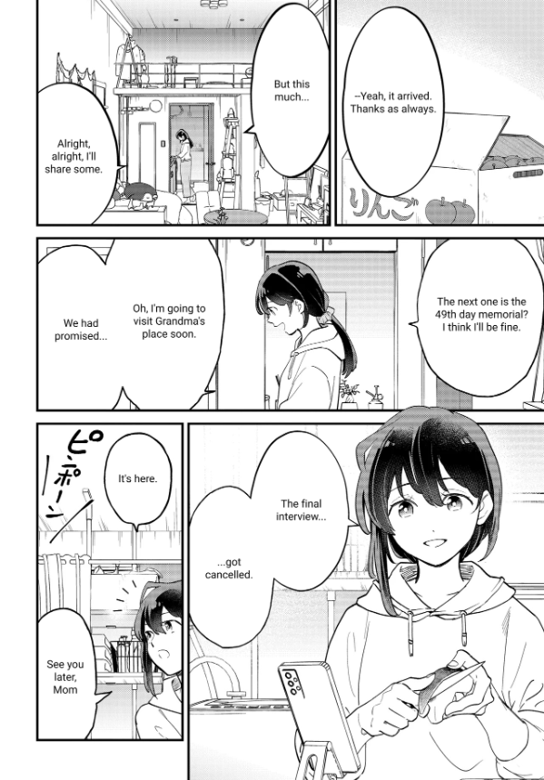

<h1 align="center">MangaTranslator Extension</h1>

<p align="center">
  Translate manga pages directly in your browser with the LLM provider you configure, a local FastAPI backend, batch page scanner, auto-translate mode, multilingual UI, and optional Flux inpainting.
</p>

<p align="center">
  <a href="docs/README.vi.md">Tiếng Việt</a>
  ·
  <a href="docs/README.zh.md">中文</a>
</p>

<p align="center">
  
  
  
  
  
</p>

<p align="center">
  <a href="#showcase">Showcase</a>
  ·
  <a href="#features">Features</a>
  ·
  <a href="#download">Download</a>
  ·
  <a href="#quick-start">Quick Start</a>
  ·
  <a href="#configuration">Configuration</a>
  ·
  <a href="#optional-flux">Optional Flux</a>
  ·
  <a href="#development">Development</a>
</p>

<p align="center">
  
</p>

## Overview

MangaTranslator Extension is a portable browser-extension stack for translating manga and comic pages. The browser extension scans images on the current page, sends them to a local backend, and replaces or previews the translated result. The backend runs locally, so the browser does not need to send manga images through a third-party extension server.

The extension uses the LLM, API key, model, and Base URL that you provide. You can connect it to Google, OpenAI, Anthropic, OpenRouter, DeepSeek, xAI, Z.ai, Moonshot AI, or any OpenAI-compatible endpoint, then keep the translation workflow inside the browser.

The default package is intentionally lighter: it includes the normal backend runtime and non-Flux models, while Flux Klein 4B is optional and can be installed later with `setup.bat`.

## Showcase

MangaTranslator Extension is built for people who want to keep reading, not copy text into separate tools. Open a chapter, scan the page, choose the images you want, and let your own LLM translate the dialogue back into the manga image.

| Popup controls | Page scanner |
| --- | --- |
|  |  |
| Configure source/target languages, outside-text detection, backend status, and one-click auto translation. | Scan a chapter, preview detected pages, select only what you need, and translate pages in batch. |

### Translation Result

| Original page | Translated page |
| --- | --- |
|  |  |
| Japanese dialogue before processing. | Cleaned bubbles with translated English text rendered back into the manga page. |

- Bring your own LLM: use the provider, API key, model, and endpoint you trust.
- Read faster with auto-translate: pages are translated as you scroll, including lookahead pages.
- Keep the manga feel: original text is cleaned and translated text is rendered back into the image.
- Translate more than bubbles: SFX, narration, captions, and other outside-bubble text can be handled too.
- Stay lightweight by default: Flux Klein 4B is optional, so normal users do not need to download a workstation-sized package.

## Features

| Area | What it does |
| --- | --- |
| Bring-your-own LLM | Uses the LLM provider, API key, model, and Base URL configured by the user. |
| Page scanner | Finds manga/comic images on the active page and lets you choose which pages to translate. |
| Auto-translate | Watches the current reading page and translates images as you scroll. |
| Bubble translation | Detects speech bubbles, removes original text, translates, and renders text back into the image. |
| Outside-bubble text | Handles SFX/narration outside speech bubbles with lightweight cleanup by default. |
| Optional Flux | Lets advanced users download Flux Klein 4B for heavier inpainting without shipping it in the default release. |
| Provider support | Google, OpenAI, Anthropic, xAI, DeepSeek, Z.ai, Moonshot AI, OpenRouter, and OpenAI-compatible endpoints. |
| Model picker | Fetches available OpenAI-compatible models from your configured Base URL. |
| UI languages | English by default, plus Vietnamese, Chinese, Japanese, and Korean. |
| Translation languages | Main source/target options include Japanese, Korean, English, and Vietnamese. |
| Portable backend | Uses `start-backend.bat`, `backend/main.py`, and optional bundled `backend/runtime/python.exe`. |

## Download

Latest release:

```text
https://github.com/lehuyqq/Manga-Translator-Extension/releases/latest
```

Recommended release assets:

| Asset | Purpose |
| --- | --- |
| `manga-translator-extension-dist-*.zip` | Built browser extension. Load the extracted `dist/` folder in Chrome/Edge. |
| `manga-translator-models-no-flux-*.zip` | Backend model files without Flux. Extract into the project root so it restores `backend/models/`. |
| `manga-translator-runtime-*.tar.gz.part01`, `part02`, ... | Split backend Python runtime. Recombine before extracting. |

Recombine split runtime parts on Windows PowerShell:

```powershell
Get-Content .\manga-translator-runtime-v1.0.1.tar.gz.part* -Encoding Byte -ReadCount 0 |
  Set-Content .\manga-translator-runtime-v1.0.1.tar.gz -Encoding Byte

tar -xzf .\manga-translator-runtime-v1.0.1.tar.gz
```

Extract models:

```powershell
Expand-Archive .\manga-translator-models-no-flux-v1.0.1.zip -DestinationPath .
```

## Quick Start

1. Download the source or clone the repository.

```powershell
git clone https://github.com/lehuyqq/Manga-Translator-Extension.git
cd Manga-Translator-Extension
```

1. Download release assets and restore `backend/runtime/` and `backend/models/`.

1. Start the backend.

```powershell
.\start-backend.bat
```

The backend should listen on:

```text
http://localhost:7677
```

1. Load the browser extension.

```powershell
cd extension
npm install
npm run build
```

Then open Chrome or Edge:

```text
chrome://extensions/
```

Enable Developer mode, choose Load unpacked, and select `extension/dist/`.

## Configuration

Open the extension popup and use the three tabs:

| Tab | Options |
| --- | --- |
| `Translate` | Source language, target language, outside-bubble text toggle. |
| `LLM Config` | Provider, Base URL, model, API key, temperature, Top P, Top K, full-page context, special instructions. |
| `Config` | Extension UI language and backend URL. |

Default backend URL:

```text
http://localhost:7677
```

Provider keys can be entered in the popup or exposed through environment variables:

```text
GOOGLE_API_KEY
OPENAI_API_KEY
ANTHROPIC_API_KEY
```

## Optional Flux

Flux is not bundled in the normal release because it adds several GB. The default outside-bubble mode uses lightweight cleanup and does not require Flux.

To install Flux Klein 4B on demand:

```powershell
.\setup.bat
```

Choose:

```text
2. Download optional Flux Klein 4B model
```

The script downloads to:

```text
backend/models/flux/
```

Use Flux only when you explicitly configure outside-text inpainting to a Flux mode such as `flux_klein_4b`. For most users, the default `auto` behavior is lighter and faster.

## Usage Workflow

1. Start the backend with `start-backend.bat`.
1. Open a manga/comic chapter in Chrome or Edge.
1. Click the MangaTranslator extension icon.
1. Choose source and target language.
1. Click Scan & Translate Page to choose images manually, or Auto-translate to translate as you scroll.
1. Review translated images on the page.

## Project Layout

```text
manga-translator-extension/
  backend/                         FastAPI backend and MangaTranslator integration
  backend/main.py                  Backend entry point
  backend/core/                    Detection, cleanup, translation, rendering
  backend/models/                  Model files restored from release assets
  backend/pipeline/                Wrapper around the core pipeline
  extension/                       Manifest V3 browser extension
  extension/src/background/        Service worker and backend requests
  extension/src/content-script/    Page scanner and auto-translate overlay
  extension/src/popup/             Popup UI
  extension/src/shared/            Types, constants, i18n
  docs/                            API docs and localized READMEs
  setup.bat                        Optional setup helper, including Flux download
  start-backend.bat                Backend launcher
```

## Development

Build the extension:

```powershell
cd extension
npm install
npm run build
```

Compile-check backend files:

```powershell
cd ..\backend
python -m py_compile pipeline\wrapper.py
```

Check backend health:

```powershell
Invoke-RestMethod http://localhost:7677/health
```

## Release Packaging

Do not commit generated runtime, models, caches, or extension build output. They are intentionally ignored:

```text
backend/runtime/
backend/models/
extension/dist/
extension/node_modules/
release-assets/
```

Use GitHub Releases for runtime/model archives. GitHub blocks files over 100 MB in normal Git history, and large runtime archives should be split so each release asset stays below GitHub's release asset limit.

## Troubleshooting

| Problem | Fix |
| --- | --- |
| Backend offline in popup | Start `.\start-backend.bat` and confirm `http://localhost:7677/health`. |
| Extension cannot connect | Check the backend URL in the `Config` tab. |
| No images found | Let the manga page finish loading, then run Scan & Translate Page again. |
| Model/provider error | Check API key, Base URL, model name, and provider selection. |
| Flux download fails | Re-run `setup.bat`, check disk space and internet connection. |
| Release runtime has `.part01` files | Recombine parts first, then extract the `.tar.gz`. |

## Security

Never commit API keys, private backend URLs, generated caches, model artifacts, `node_modules`, `dist`, or a full Python runtime. Keep secrets in the extension popup or environment variables.

## License

This portable build includes code derived from MangaTranslator. Keep upstream license requirements with any redistribution.
