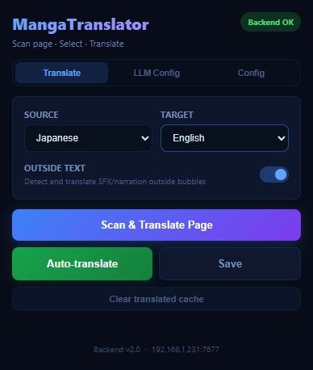
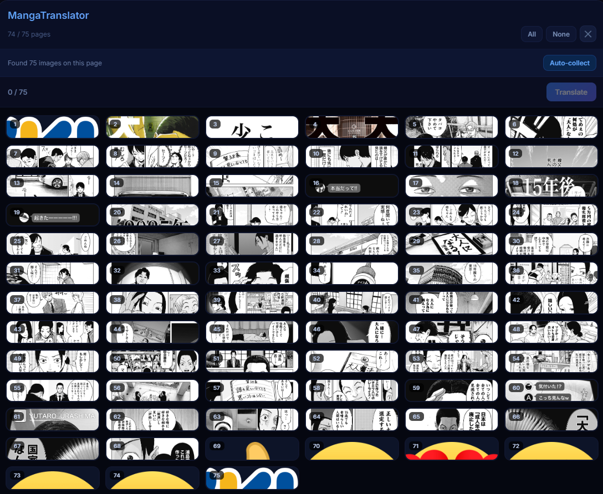

<h1 align="center">MangaTranslator Extension</h1>

<p align="center">
  Dịch trang manga trực tiếp trong trình duyệt bằng backend FastAPI cục bộ, trình quét theo lô, chế độ tự động dịch, giao diện đa ngôn ngữ và Flux inpainting tùy chọn.
</p>

<p align="center">
  <a href="../README.md">English</a>
  ·
  <a href="README.zh.md">中文</a>
</p>

<p align="center">
  
  
  
  
  
</p>

<p align="center">
  <a href="#showcase">Showcase</a>
  ·
  <a href="#tổng-quan">Tổng Quan</a>
  ·
  <a href="#tính-năng">Tính Năng</a>
  ·
  <a href="#tải-xuống">Tải Xuống</a>
  ·
  <a href="#bắt-đầu-nhanh">Bắt Đầu Nhanh</a>
  ·
  <a href="#cấu-hình">Cấu Hình</a>
  ·
  <a href="#flux-tùy-chọn">Flux Tùy Chọn</a>
</p>

<p align="center">
  
</p>

<p align="center">
  
  
</p>

## Showcase

MangaTranslator Extension được tạo cho người đọc muốn đọc truyện liền mạch, không phải copy từng câu sang công cụ khác. Mở một chapter, quét trang, chọn ảnh cần dịch, và để LLM của bạn dịch lời thoại rồi render lại vào ảnh manga.

- Sử dụng LLM của bạn: cấu hình provider, API key, model và endpoint mà bạn tin dùng.
- Đọc nhanh hơn với auto-translate: ảnh được dịch khi bạn cuộn trang, kèm dịch trước các trang sắp tới.
- Giữ cảm giác manga: chữ gốc được xóa và chữ dịch được render lại vào ảnh.
- Dịch cả ngoài bubble: hỗ trợ SFX, lời dẫn, caption và các đoạn chữ nằm ngoài bóng thoại.
- Nhẹ hơn theo mặc định: Flux Klein 4B là tùy chọn, nên người dùng thông thường không phải tải một gói quá nặng.

## Tổng Quan

MangaTranslator Extension là bộ extension + backend portable để dịch trang manga/comic. Extension trong trình duyệt quét ảnh trên tab hiện tại, gửi ảnh đến backend cục bộ, rồi thay hoặc hiển thị bản dịch đã render. Backend chạy trên máy của bạn, nên extension không cần gửi ảnh manga qua một máy chủ extension bên thứ ba.

Extension sử dụng LLM, API key, model và Base URL do bạn cung cấp. Bạn có thể kết nối Google, OpenAI, Anthropic, OpenRouter, DeepSeek, xAI, Z.ai, Moonshot AI hoặc bất kỳ endpoint OpenAI-compatible nào, sau đó giữ toàn bộ workflow dịch ngay trong trình duyệt.

Gói mặc định được giữ nhẹ hơn: bao gồm runtime backend và model không có Flux, còn Flux Klein 4B là tùy chọn và có thể cài sau bằng `setup.bat`.

## Tính Năng

| Khu vực | Chức năng |
| --- | --- |
| LLM của bạn | Sử dụng provider, API key, model và Base URL do người dùng cấu hình. |
| Trình quét trang | Tìm ảnh manga/comic trên trang hiện tại và cho phép chọn trang cần dịch. |
| Tự động dịch | Theo dõi trang đọc hiện tại và dịch ảnh khi bạn cuộn. |
| Dịch bubble | Nhận diện bubble thoại, xóa chữ gốc, dịch và render chữ lại vào ảnh. |
| Chữ ngoài bubble | Xử lý SFX/lời dẫn ngoài bubble bằng cleanup nhẹ mặc định. |
| Flux tùy chọn | Cho phép người dùng nâng cao tải Flux Klein 4B để inpainting nặng hơn mà không làm nặng release mặc định. |
| Provider | Google, OpenAI, Anthropic, xAI, DeepSeek, Z.ai, Moonshot AI, OpenRouter và endpoint OpenAI-compatible. |
| Chọn model | Lấy danh sách model OpenAI-compatible từ Base URL đã cấu hình. |
| Ngôn ngữ UI | Tiếng Anh mặc định, kèm tiếng Việt, tiếng Trung, tiếng Nhật và tiếng Hàn. |
| Ngôn ngữ dịch | Các lựa chọn chính gồm tiếng Nhật, tiếng Hàn, tiếng Anh và tiếng Việt. |
| Backend portable | Dùng `start-backend.bat`, `backend/main.py` và runtime `backend/runtime/python.exe` nếu có. |

## Tải Xuống

Release mới nhất:

```text
https://github.com/lehuyqq/Manga-Translator-Extension/releases/latest
```

Các asset nên tải:

| Asset | Mục đích |
| --- | --- |
| `manga-translator-extension-dist-*.zip` | Extension đã build. Giải nén và load thư mục `dist/` trong Chrome/Edge. |
| `manga-translator-models-no-flux-*.zip` | Model backend không bao gồm Flux. Giải nén vào root project để khôi phục `backend/models/`. |
| `manga-translator-runtime-*.tar.gz.part01`, `part02`, ... | Runtime Python backend đã chia part. Cần ghép lại trước khi giải nén. |

Ghép runtime đã chia part trên Windows PowerShell:

```powershell
Get-Content .\manga-translator-runtime-v1.0.1.tar.gz.part* -Encoding Byte -ReadCount 0 |
  Set-Content .\manga-translator-runtime-v1.0.1.tar.gz -Encoding Byte

tar -xzf .\manga-translator-runtime-v1.0.1.tar.gz
```

Giải nén model:

```powershell
Expand-Archive .\manga-translator-models-no-flux-v1.0.1.zip -DestinationPath .
```

## Bắt Đầu Nhanh

1. Tải source hoặc clone repository.

```powershell
git clone https://github.com/lehuyqq/Manga-Translator-Extension.git
cd Manga-Translator-Extension
```

1. Tải release assets và khôi phục `backend/runtime/` cùng `backend/models/`.

1. Khởi động backend.

```powershell
.\start-backend.bat
```

Backend sẽ lắng nghe tại:

```text
http://localhost:7677
```

1. Load extension trình duyệt.

```powershell
cd extension
npm install
npm run build
```

Sau đó mở Chrome hoặc Edge:

```text
chrome://extensions/
```

Bật Developer mode, chọn Load unpacked và chọn `extension/dist/`.

## Cấu Hình

Mở popup extension và dùng ba tab:

| Tab | Tùy chọn |
| --- | --- |
| `Translate` | Ngôn ngữ nguồn, ngôn ngữ đích, bật/tắt chữ ngoài bubble. |
| `LLM Config` | Provider, Base URL, model, API key, temperature, Top P, Top K, ngữ cảnh toàn trang, chỉ dẫn bổ sung. |
| `Config` | Ngôn ngữ giao diện extension và backend URL. |

Backend URL mặc định:

```text
http://localhost:7677
```

Provider key có thể nhập trong popup hoặc truyền qua biến môi trường:

```text
GOOGLE_API_KEY
OPENAI_API_KEY
ANTHROPIC_API_KEY
```

## Flux Tùy Chọn

Flux không đi kèm release thường vì tăng dung lượng thêm vài GB. Chế độ chữ ngoài bubble mặc định dùng cleanup nhẹ và không cần Flux.

Cài Flux Klein 4B khi cần:

```powershell
.\setup.bat
```

Chọn:

```text
2. Download optional Flux Klein 4B model
```

Script sẽ tải vào:

```text
backend/models/flux/
```

Chỉ dùng Flux khi bạn cấu hình outside-text inpainting sang một mode Flux như `flux_klein_4b`. Với đa số người dùng, mặc định `auto` nhẹ hơn và nhanh hơn.

## Quy Trình Sử Dụng

1. Chạy backend bằng `start-backend.bat`.
1. Mở chapter manga/comic trong Chrome hoặc Edge.
1. Bấm biểu tượng MangaTranslator.
1. Chọn ngôn ngữ nguồn và đích.
1. Bấm Scan & Translate Page để chọn ảnh thủ công, hoặc Auto-translate để dịch khi cuộn.
1. Kiểm tra ảnh đã dịch trên trang.

## Cấu Trúc Dự Án

```text
manga-translator-extension/
  backend/                         Backend FastAPI và tích hợp MangaTranslator
  backend/main.py                  Điểm vào backend
  backend/core/                    Nhận diện, cleanup, dịch, render
  backend/models/                  Model khôi phục từ release assets
  backend/pipeline/                Wrapper quanh core pipeline
  extension/                       Browser extension Manifest V3
  extension/src/background/        Service worker và request tới backend
  extension/src/content-script/    Trình quét trang và overlay tự động dịch
  extension/src/popup/             Giao diện popup
  extension/src/shared/            Types, constants, i18n
  docs/                            API docs và README đa ngôn ngữ
  setup.bat                        Trợ lý setup tùy chọn, gồm tải Flux
  start-backend.bat                Launcher backend
```

## Phát Triển

Build extension:

```powershell
cd extension
npm install
npm run build
```

Compile-check backend:

```powershell
cd ..\backend
python -m py_compile pipeline\wrapper.py
```

Kiểm tra health backend:

```powershell
Invoke-RestMethod http://localhost:7677/health
```

## Đóng Gói Release

Không commit runtime, model, cache hoặc build output. Các đường dẫn này được ignore có chủ đích:

```text
backend/runtime/
backend/models/
extension/dist/
extension/node_modules/
release-assets/
```

Hãy dùng GitHub Releases cho runtime/model archives. GitHub chặn file trên 100 MB trong Git history thường, và archive runtime lớn nên được chia nhỏ để mỗi release asset nằm dưới giới hạn của GitHub.

## Khắc Phục Sự Cố

| Lỗi | Cách xử lý |
| --- | --- |
| Popup báo backend offline | Chạy `.\start-backend.bat` và kiểm tra `http://localhost:7677/health`. |
| Extension không kết nối được | Kiểm tra backend URL trong tab `Config`. |
| Không tìm thấy ảnh | Chờ trang manga load xong rồi chạy Scan & Translate Page lại. |
| Lỗi model/provider | Kiểm tra API key, Base URL, model name và provider đã chọn. |
| Tải Flux thất bại | Chạy lại `setup.bat`, kiểm tra dung lượng ổ đĩa và kết nối mạng. |
| Runtime release có file `.part01` | Ghép các part trước, rồi giải nén file `.tar.gz`. |

## Bảo Mật

Không commit API key, backend URL riêng, cache sinh ra, model artifact, `node_modules`, `dist` hoặc toàn bộ Python runtime. Giữ secrets trong popup extension hoặc biến môi trường.

## Giấy Phép

Bản portable này chứa code phát triển từ MangaTranslator. Hãy giữ đúng yêu cầu license upstream khi phân phối lại.
